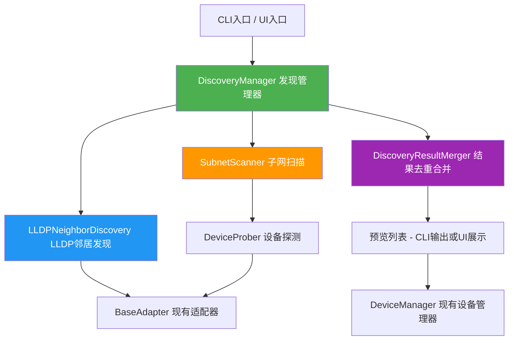
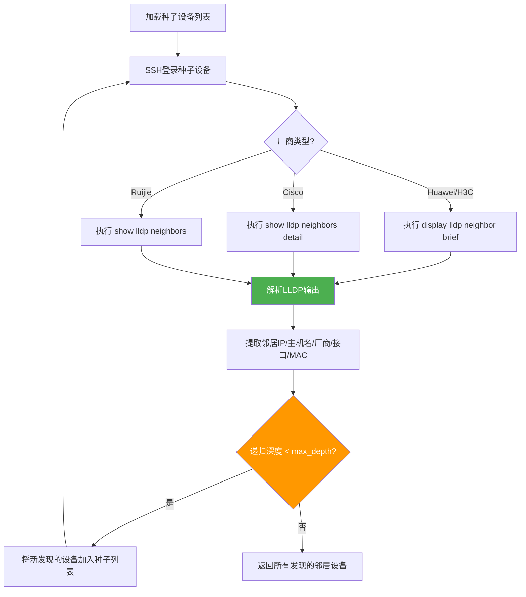
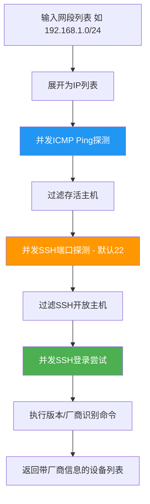
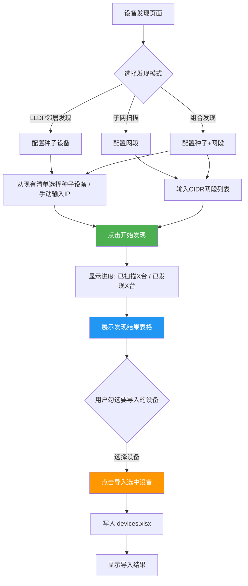

# 设备自发现功能 — 详细设计方案

> 版本: 1.0  
> 日期: 2026-06-12  
> 状态: 待评审

---

## 1. 功能概述

为 IRIS Network Valkyrie 新增 **设备自发现** 功能，支持两种发现模式：

| 模式              | 原理                                                           | 适用场景                                 |
| ----------------- | -------------------------------------------------------------- | ---------------------------------------- |
| LLDP/CDP 邻居发现 | 从种子设备 SSH 登录后执行 LLDP/CDP 命令，递归发现邻居          | 已有部分设备清单，需要扩展发现整网拓扑   |
| 子网扫描          | 指定网段进行 ICMP Ping + SSH 端口探测，再尝试 SSH 登录识别厂商 | 已知网段范围，需要发现网段内所有网络设备 |

**核心流程**：发现 → 去重 → 预览列表 → 用户勾选 → 批量导入设备清单

---

## 2. 系统架构

### 2.1 模块依赖关系



### 2.2 新增文件清单

```
CoreBase/core/discovery/
├── __init__.py              # 模块导出
├── manager.py               # DiscoveryManager - 发现流程编排
├── lldp_discovery.py        # LLDPNeighborDiscovery - LLDP/CDP邻居发现
├── subnet_scanner.py        # SubnetScanner - 子网扫描
├── device_prober.py         # DeviceProber - 单设备SSH探测+厂商识别
├── vendor_identifier.py     # 厂商识别逻辑（基于SSH Banner/命令输出）
└── discovery_models.py      # 数据模型定义
```

### 2.3 需修改的现有文件

| 文件                                                             | 修改内容                                           |
| ---------------------------------------------------------------- | -------------------------------------------------- |
| [`CoreBase/config/config.yaml`](CoreBase/config/config.yaml)     | 新增 `discovery` 配置段                            |
| [`CoreBase/config/commands.yaml`](CoreBase/config/commands.yaml) | 新增 `discovery` 命令组（LLDP/CDP/版本信息采集）   |
| [`CoreBase/main.py`](CoreBase/main.py)                           | 新增 CLI 参数 `--discover`、`--discover-subnet` 等 |
| [`CoreBase/ui/app.py`](CoreBase/ui/app.py)                       | UI 中新增"设备发现"页面/标签页                     |
| [`CoreBase/core/utils.py`](CoreBase/core/utils.py)               | 复用 `load_passwords` 获取发现用的凭证             |

---

## 3. 数据模型

### 3.1 发现结果模型

```python
# CoreBase/core/discovery/discovery_models.py

@dataclass
class DiscoveredDevice:
    """发现的设备信息"""
    ip: str                               # IP地址
    hostname: str = ""                    # 设备主机名
    vendor: str = ""                      # 识别出的厂商 (huawei/h3c/ruijie/cisco/maipu/wst/unknown)
    vendor_raw: str = ""                  # 原始厂商信息
    device_type: str = ""                 # 设备类型 (交换机/路由器/防火墙/未知)
    model: str = ""                       # 设备型号
    mac_address: str = ""                 # MAC地址
    management_ip: str = ""               # 管理IP (可能与发现IP不同)
    source: str = ""                      # 发现来源: lldp / cdp / subnet_scan
    source_device: str = ""               # 从哪台设备发现的 (种子设备IP)
    source_interface: str = ""            # 通过哪个接口发现的
    ssh_reachable: bool = False           # SSH是否可达
    identified: bool = False              # 是否成功识别厂商
    ssh_port: int = 22                    # SSH端口
    remarks: str = ""                     # 备注

    def to_inventory_dict(self) -> dict:
        """转换为设备清单格式，用于导入"""
        return {
            "设备名": self.hostname or f"Discovered_{self.ip}",
            "IP地址": self.management_ip or self.ip,
            "生产厂商": self.vendor_raw or self.vendor or "unknown",
            "端口": str(self.ssh_port),
            "备注": self.remarks or f"自动发现于 {self.source} via {self.source_device}",
        }


@dataclass  
class DiscoveryResult:
    """发现任务结果"""
    devices: List[DiscoveredDevice]        # 所有发现的设备
    duplicates_removed: int = 0            # 去重移除的数量
    already_in_inventory: int = 0          # 已在设备清单中的数量
    scan_duration: float = 0.0             # 扫描耗时 (秒)
    errors: List[str] = field(default_factory=list)  # 错误信息列表
    
    @property
    def new_devices(self) -> List[DiscoveredDevice]:
        """不在现有清单中的新设备"""
        return [d for d in self.devices if d.identified]
```

---

## 4. 核心模块设计

### 4.1 LLDP/CDP 邻居发现



**关键命令映射**（新增到 [`commands.yaml`](CoreBase/config/commands.yaml)）：

```yaml
# discovery 命令组 - 用于设备自发现
discovery_groups:
  lldp_commands:
    lldp_neighbor: display lldp neighbor brief
    lldp_neighbor_detail: display lldp neighbor
    
  cisco_lldp_commands:
    lldp_neighbor: show lldp neighbors
    lldp_neighbor_detail: show lldp neighbors detail
    cdp_neighbor: show cdp neighbors detail
```

**输出解析策略**（各厂商 LLDP/CDP 输出格式不同）：

| 厂商   | 命令                                     | 关键字段提取正则                  |
| ------ | ---------------------------------------- | --------------------------------- |
| Huawei | `display lldp neighbor brief`            | 邻居名称、管理IP、Agent Type      |
| H3C    | `display lldp neighbor-information list` | 邻居名称、管理IP                  |
| Cisco  | `show lldp neighbors detail`             | System Name、Management Addresses |
| Cisco  | `show cdp neighbors detail`              | Device ID、IP address、Platform   |
| Ruijie | `show lldp neighbors`                    | Device ID、Port ID                |

### 4.2 子网扫描



**子网扫描参数**：

```yaml
# config.yaml 新增 discovery 段
discovery:
  subnet_scan:
    ping_timeout: 1          # ICMP Ping 超时 (秒)
    ping_count: 1            # Ping 次数
    ssh_timeout: 3           # SSH 端口探测超时 (秒)
    max_workers: 50          # 并发扫描线程数
    ssh_ports: [22, 2222]    # 探测的SSH端口列表
  lldp:
    max_depth: 3             # LLDP递归发现最大深度
    max_devices: 200         # 最大发现设备数 (安全限制)
    timeout_per_device: 30   # 单设备发现超时 (秒)
```

### 4.3 设备探测与厂商识别

```python
# vendor_identifier.py 核心逻辑

class VendorIdentifier:
    """通过SSH连接识别设备厂商"""
    
    # 识别策略优先级:
    # 1. SSH Banner (连接握手时的 Banner)
    # 2. 执行通用命令获取输出特征
    # 3. 提示符特征
    
    VENDOR_PATTERNS = {
        "huawei": {
            "banner": ["Huawei", "HUAWEI"],
            "prompt": ["<", ">"],       # 如 <HUAWEI>
            "commands": ["display version"],
            "output_keywords": ["Huawei", "HUAWEI", "VRP"],
        },
        "h3c": {
            "banner": ["H3C", "Comware"],
            "prompt": ["<", ">"],
            "commands": ["display version"],
            "output_keywords": ["H3C", "Comware", "HP"],
        },
        "cisco": {
            "banner": ["Cisco", "CISCO"],
            "prompt": ["#"],            # 如 Router#
            "commands": ["show version"],
            "output_keywords": ["Cisco", "IOS", "NX-OS"],
        },
        "ruijie": {
            "banner": ["Ruijie", "RGOS"],
            "prompt": ["#"],
            "commands": ["show version"],
            "output_keywords": ["Ruijie", "RGOS"],
        },
        "maipu": {
            "banner": ["Maipu", "MP"],
            "prompt": ["#"],
            "commands": ["show version"],
            "output_keywords": ["Maipu", "MP"],
        },
        "wst": {
            "banner": ["WST"],
            "prompt": [">"],
            "commands": ["show version"],
            "output_keywords": ["WST"],
        },
    }
```

### 4.4 发现管理器 (Orchestrator)

```python
# manager.py 核心接口

class DiscoveryManager:
    """设备发现管理器 - 编排发现流程"""
    
    def __init__(self, config: dict, passwords: dict):
        self.config = config
        self.passwords = passwords  # 从 password.conf 加载的凭证
        self.lldp = LLDPNeighborDiscovery(config, passwords)
        self.scanner = SubnetScanner(config, passwords)
        self.merger = DiscoveryResultMerger()
    
    def discover_from_seeds(
        self, 
        seed_devices: List[dict],  # 种子设备列表 (来自现有清单)
        max_depth: int = 3,
        exclude_ips: set = None,   # 排除的IP (已知的设备)
    ) -> DiscoveryResult:
        """从种子设备通过 LLDP/CDP 发现邻居"""
        ...
    
    def scan_subnets(
        self,
        subnets: List[str],        # 如 ["192.168.1.0/24", "10.0.0.0/16"]
        exclude_ips: set = None,
    ) -> DiscoveryResult:
        """扫描指定子网"""
        ...
    
    def combined_discover(
        self,
        seed_devices: List[dict],
        subnets: List[str],
        max_depth: int = 3,
    ) -> DiscoveryResult:
        """组合发现: LLDP邻居 + 子网扫描，自动去重"""
        lldp_result = self.discover_from_seeds(seed_devices, max_depth)
        subnet_result = self.scan_subnets(subnets)
        return self.merger.merge(lldp_result, subnet_result, exclude_ips=...)
    
    def get_device_credentials(self, vendor: str) -> tuple:
        """根据厂商获取凭证，按优先级尝试"""
        # 1. 精确匹配厂商
        # 2. default 凭证
        # 3. 逐个尝试所有已配置凭证
        ...
```

---

## 5. CLI 接口设计

在 [`CoreBase/main.py`](CoreBase/main.py) 的 `parse_arguments()` 中新增参数组：

```bash
# === LLDP 邻居发现 ===
python main.py --discover lldp                    # 使用现有设备清单中所有设备作为种子
python main.py --discover lldp --seed-ip 192.168.1.1  # 指定种子设备IP
python main.py --discover lldp --depth 2          # 递归深度

# === 子网扫描 ===
python main.py --discover subnet --subnets 192.168.1.0/24
python main.py --discover subnet --subnets 10.0.0.0/24,172.16.0.0/24

# === 组合发现 ===
python main.py --discover all --subnets 192.168.1.0/24 --depth 2

# === 通用选项 ===
python main.py --discover lldp --discover-output discovered.xlsx  # 导出发现结果
python main.py --discover lldp --discover-import                 # 发现后交互式选择导入
python main.py --discover subnet --subnets ... --discover-dry-run # 只扫描不尝试SSH登录
```

**新增参数定义**：

| 参数                 | 类型 | 说明                                |
| -------------------- | ---- | ----------------------------------- |
| `--discover`         | str  | 发现模式: `lldp` / `subnet` / `all` |
| `--subnets`          | str  | 子网列表，逗号分隔 (CIDR格式)       |
| `--seed-ip`          | str  | 种子设备IP (仅lldp模式)             |
| `--depth`            | int  | LLDP递归深度，默认3                 |
| `--discover-output`  | str  | 发现结果输出文件路径                |
| `--discover-import`  | flag | 发现后进入交互式导入流程            |
| `--discover-dry-run` | flag | 仅探测可达性，不尝试SSH登录         |

---

## 6. UI 接口设计

在 [`CoreBase/ui/app.py`](CoreBase/ui/app.py) 的 Streamlit 应用中新增 **"设备发现"** 页面/标签页。

### 6.1 UI 流程



### 6.2 发现结果展示字段

| 列      | 说明                      |
| ------- | ------------------------- |
| ☑️       | 勾选框                    |
| IP地址  | 设备IP                    |
| 主机名  | 从设备获取的主机名        |
| 厂商    | 识别出的厂商 (带颜色标签) |
| 型号    | 设备型号                  |
| 来源    | LLDP / CDP / 子网扫描     |
| 发现自  | 从哪台设备/哪个网段发现   |
| SSH状态 | ✅ 可连接 / ❌ 不可连接     |
| 状态    | 🆕 新设备 / ⚠️ 已存在于清单 |

---

## 7. 去重与合并策略

```python
# discovery/merger.py

class DiscoveryResultMerger:
    """发现结果去重与合并"""
    
    def merge(
        self, 
        results: List[DiscoveryResult],
        existing_ips: set = None,    # 现有设备清单中的IP
    ) -> DiscoveryResult:
        """
        去重规则:
        1. 主键: IP地址 (management_ip 优先于 discovery_ip)
        2. 同一IP多次发现时，信息更完整的记录优先
        3. 优先级: 已SSH识别 > 未识别; lldp来源 > subnet来源
        4. 标记已在现有清单中的设备
        """
        ...
    
    def _deduplicate(self, devices: List[DiscoveredDevice]) -> List[DiscoveredDevice]:
        """基于IP去重，保留信息最丰富的记录"""
        ...
    
    def _enrichment_score(self, device: DiscoveredDevice) -> int:
        """计算设备信息完整度分数，用于去重时选择最佳记录"""
        score = 0
        if device.hostname: score += 2
        if device.vendor and device.vendor != "unknown": score += 3
        if device.model: score += 2
        if device.ssh_reachable: score += 1
        if device.mac_address: score += 1
        if device.source == "lldp": score += 1  # LLDP信息通常更准确
        return score
```

---

## 8. 配置文件变更

### 8.1 [`config.yaml`](CoreBase/config/config.yaml) 新增段

```yaml
# ============================================================
# 设备发现配置 (Device Discovery Configuration)
# ============================================================
discovery:
  # 是否启用设备发现功能
  enabled: true
  
  # LLDP/CDP邻居发现配置
  lldp:
    max_depth: 3               # 递归发现最大深度
    max_devices: 200           # 安全限制: 最大发现设备数
    timeout_per_device: 30     # 单设备发现超时 (秒)
    use_cdp: true              # 是否同时尝试CDP (Cisco设备)
    max_workers: 5             # LLDP发现并发数 (不宜过高)
  
  # 子网扫描配置
  subnet_scan:
    ping_timeout: 1            # ICMP Ping 超时 (秒)
    ping_count: 1              # Ping 次数
    ssh_timeout: 3             # SSH端口探测超时 (秒)
    ssh_ports: [22]            # 探测的SSH端口列表
    max_workers: 50            # 并发扫描线程数
    try_ssh_login: true        # 是否尝试SSH登录识别厂商
  
  # 厂商识别配置
  identification:
    login_timeout: 10          # SSH登录超时 (秒)
    command_timeout: 10        # 命令执行超时 (秒)
    try_all_credentials: true  # 凭证不匹配时尝试所有已配置凭证
```

### 8.2 [`commands.yaml`](CoreBase/config/commands.yaml) 新增命令组

```yaml
# 在 groups 段新增:
  discovery_huawei:
    lldp_neighbor: display lldp neighbor brief
    lldp_neighbor_detail: display lldp neighbor
    version_brief: display version
    
  discovery_h3c:
    lldp_neighbor: display lldp neighbor-information list
    lldp_neighbor_detail: display lldp neighbor-information
    version_brief: display version
    
  discovery_cisco:
    lldp_neighbor: show lldp neighbors
    lldp_neighbor_detail: show lldp neighbors detail
    cdp_neighbor: show cdp neighbors
    cdp_neighbor_detail: show cdp neighbors detail
    version_brief: show version | include Software|image|uptime
    
  discovery_ruijie:
    lldp_neighbor: show lldp neighbors
    version_brief: show version | include System
    
  discovery_maipu:
    version_brief: show version
    
  discovery_wst:
    version_brief: show version

# 在各厂商 vendor 段新增:
# huawei:
#   discovery_groups:
#     - discovery_huawei
#   discovery:
#     lldp_neighbor: display lldp neighbor brief
#     ...
```

---

## 9. 错误处理与安全考量

### 9.1 错误处理

| 场景           | 处理策略                                                    |
| -------------- | ----------------------------------------------------------- |
| 种子设备不可达 | 跳过并记录警告，继续处理其他种子设备                        |
| SSH认证失败    | 标记为 `ssh_reachable=True, identified=False`，尝试其他凭证 |
| LLDP未启用     | 记录警告，返回空邻居列表                                    |
| 递归深度超限   | 停止递归，返回已发现的结果                                  |
| 发现设备数超限 | 达到 `max_devices` 后立即停止                               |
| 子网范围过大   | 提示用户确认，建议使用更小网段                              |

### 9.2 安全考量

- **凭证安全**: 复用现有 [`password.conf`](CoreBase/config/password_example.conf) 机制，支持加密密码
- **范围限制**: `max_depth` 和 `max_devices` 防止无限递归扫描
- **只读操作**: 发现过程只执行 `display` / `show` 类只读命令
- **网络影响**: 子网扫描并发数可配置，避免对网络造成过大冲击
- **日志审计**: 所有发现操作记录到日志，包括来源设备和目标IP

---

## 10. 测试策略

| 测试类型 | 范围                                                       |
| -------- | ---------------------------------------------------------- |
| 单元测试 | LLDP/CDP输出解析（各厂商格式）、去重逻辑、厂商识别模式匹配 |
| 集成测试 | 完整发现流程（使用mock SSH连接）                           |
| 手动测试 | 实际环境中的LLDP发现和子网扫描                             |

---

## 11. 实施步骤（执行顺序）

1. **创建 `discovery` 模块骨架** — 新建目录和文件结构
2. **实现 `discovery_models.py`** — 数据模型定义
3. **实现 `vendor_identifier.py`** — 厂商识别逻辑（SSH Banner + 命令输出分析）
4. **实现 `device_prober.py`** — 单设备SSH探测（基于现有适配器体系）
5. **实现 `lldp_discovery.py`** — LLDP/CDP邻居发现 + 输出解析
6. **实现 `subnet_scanner.py`** — 子网扫描（Ping + SSH端口探测 + 厂商识别）
7. **实现 `merger.py`** — 发现结果去重合并
8. **实现 `manager.py`** — 发现管理器，编排完整流程
9. **更新 `commands.yaml`** — 添加 discovery 命令组
10. **更新 `config.yaml`** — 添加 discovery 配置段
11. **CLI集成** — 修改 [`CoreBase/main.py`](CoreBase/main.py) 添加 `--discover` 参数和执行逻辑
12. **UI集成** — 修改 [`CoreBase/ui/app.py`](CoreBase/ui/app.py) 添加设备发现页面
13. **编写测试** — 单元测试和集成测试
14. **更新文档** — README、ARCHITECTURE 等
